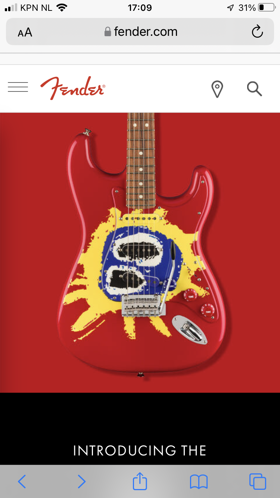
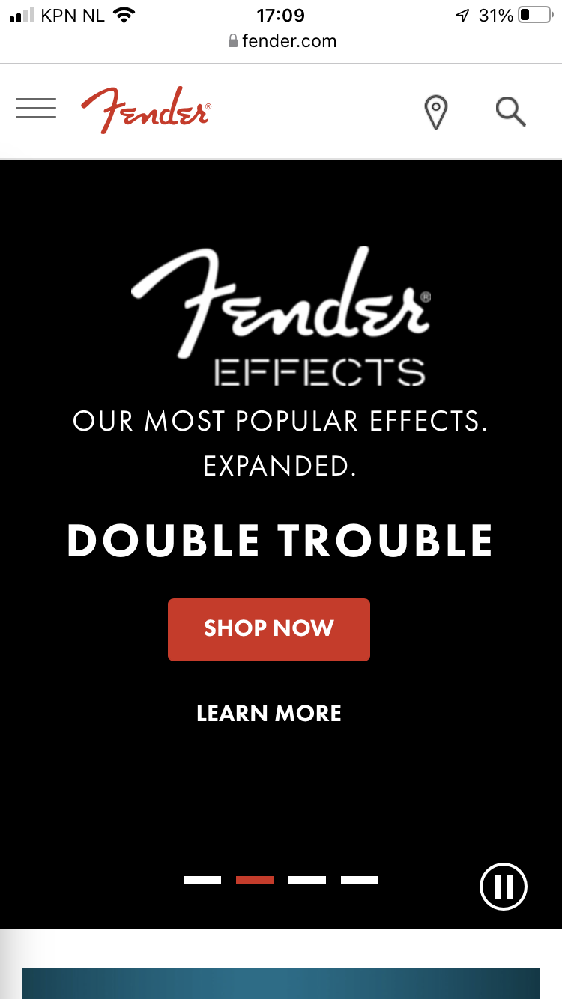
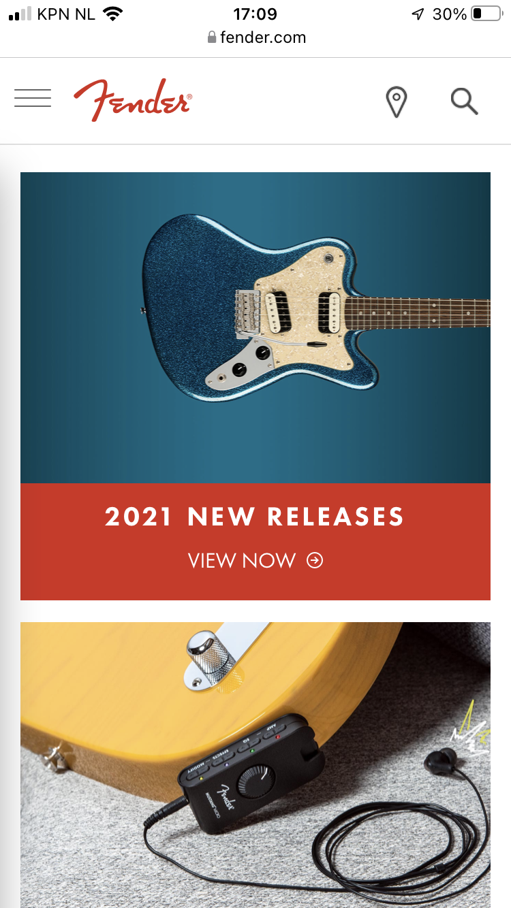
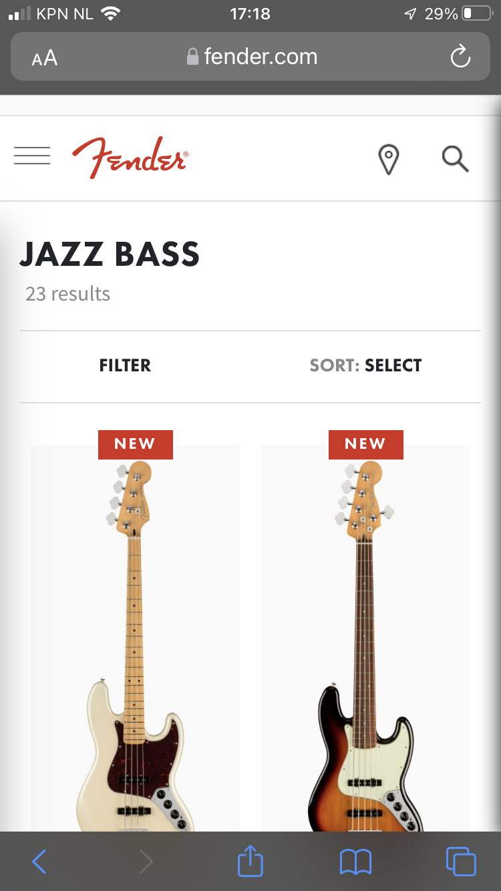
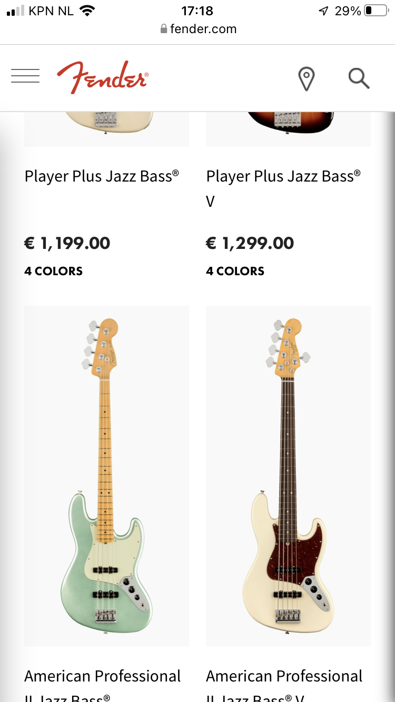
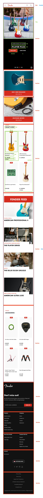
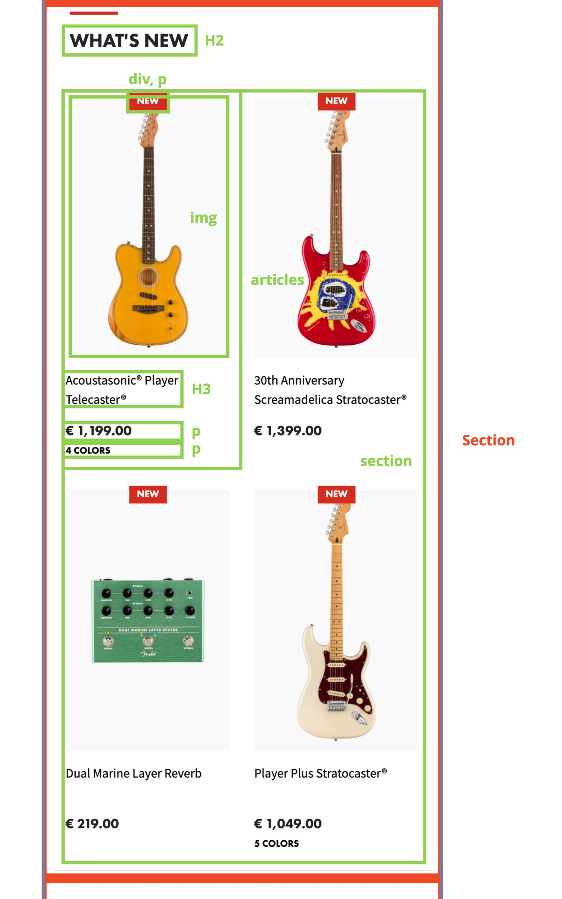

# Procesverslag
Markdown is een simpele manier om HTML te schrijven.  
Markdown cheat cheet: [Hulp bij het schrijven van Markdown](https://github.com/adam-p/markdown-here/wiki/Markdown-Cheatsheet).

Nb. De standaardstructuur en de spartaanse opmaak van de README.md zijn helemaal prima. Het gaat om de inhoud van je procesverslag. Besteedt de tijd voor pracht en praal aan je website.

Nb. Door *open* toe te voegen aan een *details* element kun je deze standaard open zetten. Fijn om dat steeds voor de relevante stuk(ken) te doen.

## Jij

uitwerken voor kick-off werkgroep

### Auteur:
Ernst Faber

#### Je startniveau:
Rood

#### Je focus:
Responsive
 

## Je website

uitwerken voor kick-off werkgroep

### Je opdracht:
https://www.fender.com

#### Screenshot(s) van de eerste pagina (small screen): 
Home  

#### Screenshot(s) van de tweede pagina (small screen):
Productpagina   

 

## Breakdownschets (week 1)

uitwerken na afloop 2e werkgroep

### de hele pagina: 

### dynamisch deel (bijv menu): 

## Voortgang 1 (week 2)

uitwerken voor 1e voortgang

### Stand van zaken
Ik vond het plaatsen van de onderdelen goed gaan, ik heb best wel veel dingen op de plek staan waar ik ze wil. Het enige wat ik nog wel lastig vind zijn de kolommen. De footer is bijv. in 2 delen gesplitst en daar de opmaak van vind ik wel moeilijk.

### Agenda voor meeting
samen met je groepje opstellen

Ernst: Hoe maak ik 2 pagina's op in 1 css document?

### Verslag van meeting
hier na afloop snel de uitkomsten van de meeting vastleggen

- Veel van mijn code zal moeten omgezet worden van px naar em.
- Onnodige enters in de HTML verwijderen.
- Voorkom DIV's en classes.
- Zet alle kleuren in variabelen, ook zwart en wit.

## Voortgang 2 (week 3)

uitwerken voor 2e voortgang

### Stand van zaken
Ik heb grotendeels van de website klaar. Er hoeven nog kleine aanpassingen gedaan te worden aan de website, maar aan de css moet nog wel veel gedaan worden. Zowel pagina 1 als 2 is de HTML volledig klaar, enkel bij pagina 2 moet ik nog wat CSS toevoegen.

### Agenda voor meeting
samen met je groepje opstellen

| Ernst             
| ---                         
| Hoe kan ik het email adres balkje zo aanpassen dat het lijkt op die van Fender? (spacing van de verstuur knop etc.)              
| Hoe kan ik de volgorde van items aanpassen in CSS?
| Hoe kan ik de balkjes boven de items plaatsen in de footer lijstjes?         

### Verslag van meeting
hier na afloop snel de uitkomsten van de meeting vastleggen

- Flex-grow en een grootte toedienen.
- In een display: flex kun je de volgorde van de items aanpassen met order.
- De footer is nu ingedeeld in grid, daarmee kun je gemakkelijk de grootte aangeven.

## Toegankelijkheidstest (week 4)

uitwerken na test in 8e voortgang

### Bevindingen
Lijst met je bevindingen die in de test naar voren kwamen:

#### Voice Over
De voice over gaat goed. De kopjes worden in een logische volgorde voorgelezen, maar wat nog niet zo goed gaat zijn de linkjes. Niet alles wat een linkje hoort te zijn is namelijk een linkje. Dit is iets wat ik nog moet toevoegen.

#### Tab
Je kan al redelijk tabben door de content van de website. De tab slaat wel volledig het menu over en het skipt de content van de verschillende lijsten waar de producten in staan. 

Alles wat klikbaar hoort te zijn, moet worden omhulst door een a tag. 

#### Beperking
Met de verschillende brillen is het contrast nog wel heel goed, maar de letterdikte van sommige kopjes zijn te dun om goed te lezen.

Het is slim om toch de dikte van de letters dikker te maken, ook al is die op de originele website heel dun.

#### Stroomschokken
Het gebruik van de website met de stroomschokken, werkte verassend genoeg best goed. De knoppen zijn heel groot dus die blijven goed klikbaar en er zijn niet te veel kleine knoppen waar je op moet drukken.

Hier een omschrijving van hoe het opgelost kan worden (met indien nodig een afbeelding)

## Voortgang 3 (week 4)

uitwerken voor 3e voortgang

### Stand van zaken
Ik had een aantal aanpassingen gedaan aan de website, waardoor er opeens veel fout ging. Alles ging op andere plekken staan dan ik wilde en het leek alsof er heel veel code weg was. Het was dus nog al een gedoe om veel elementen weer te veranderen naar hun originele positie, daar had ik soms hulp bij nodig. 

### Agenda voor meeting
samen met je groepje opstellen

| Ernst      
| ---            
| Hoe kan ik het hamburger menu laten meescrollen op de hele pagina?
| Het menu moet veranderen op basis van het schermgrootte. Hoe krijg ik de items van het hamburger menu in het normale menu?
| Hoe kan ik tekst bovenop een afbeelding krijgen?
| ...            

### Verslag van meeting
hier na afloop snel de uitkomsten van de meeting vastleggen

- Je moet zowel het menu als het hamburgermenu fixed maken, dit zorgd ervoor dat beide elementen meescrollen.
- Het menu op telefoon moet al de items bevatten voor het grootte menu, maar dan onzichtbaar. Daarna kan ik het weer zichtbaar maken op een groter scherm.
- Je kan een section een achtergrond afbeelding geven, alle tekst in de section gaat dan over de afbeelding.

## Eindgesprek (week 5)

uitwerken voor eindgesprek

### Stand van zaken
Ik vond het moeilijk om mijn css meteen netjes te krijgen door zoveel mogelijk EM waarders te gebruiken. Ook heb ik niet meteen van alles wat klikbaar zou moeten zijn, een linkje gemaakt. Doordat ik weet dat ik een 'dummy' website maak, stond ik er niet bij stil dat het niet toevoegen van linkjes het tabben beinvloed. De structuur van de HTML was soms ook even lastig. Ik had niet altijd alle elementen die nodig waren in de eerste keer coderen toegevoegd, waardoor de css-styling ook vaak aangepast moest worden. Voor de volgende keer zou ik betere breakdown schetsen maken, zodat ik meteen alle elementen in 1 keer goed heb. Verder vond ik dat het namaken van de website me wel goed afging en dat er al snel goed resultaat was. Over de uiteindelijke uitwerking ben ik zeer tevreden, het proces had wat meer vlekkeloos gemogen.

### Screenshot(s)

## Bronnenlijst

continu bijhouden terwijl je werkt

Nb. Wees specifiek ('css-tricks' als bron is bijv. niet specifiek genoeg).

1. https://www.w3schools.com/css/css_rwd_mediaqueries.asp Heeft me geholpen de media queries te maken.
2. https://stackoverflow.com/questions/10166250/creating-a-border-like-this-using-before-and-after-pseudo-elements-in-css Sommige van de H3's hebben een kleine border boven op, dit kun je realiseren met before en after. 
3. https://dev.to/nazanin_ashrafi/how-to-darken-an-image-with-css-4f5h Om de opacity aan te passen van een afbeelding heb ik deze bron gebruikt.
4. https://stackoverflow.com/questions/1457849/how-to-remove-the-border-highlight-on-an-input-text-element Om de styling mooi te maken van het aanmeld formulier heb ik deze bron gebruikt. In specifiek om de hightlight weg te krijgen.
5. https://stackoverflow.com/questions/27853884/media-queries-and-image-swapping Veranderen van background image
6. https://www.w3schools.com/cssref/pr_background-image.asp Voor het toevoegen van een achtergrond afbeelding op een section

